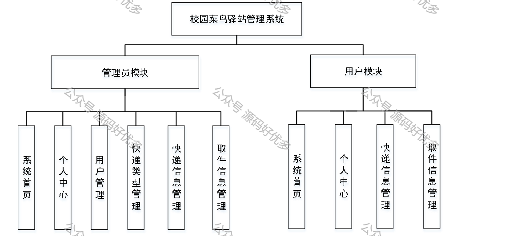
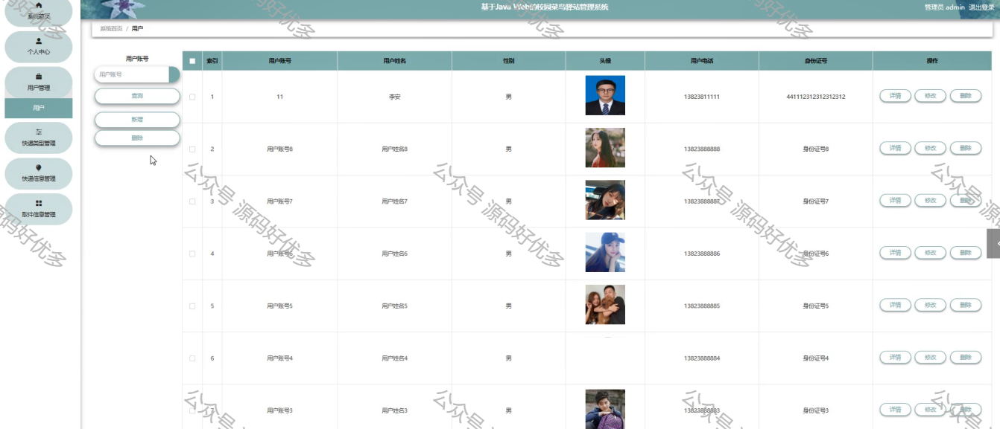
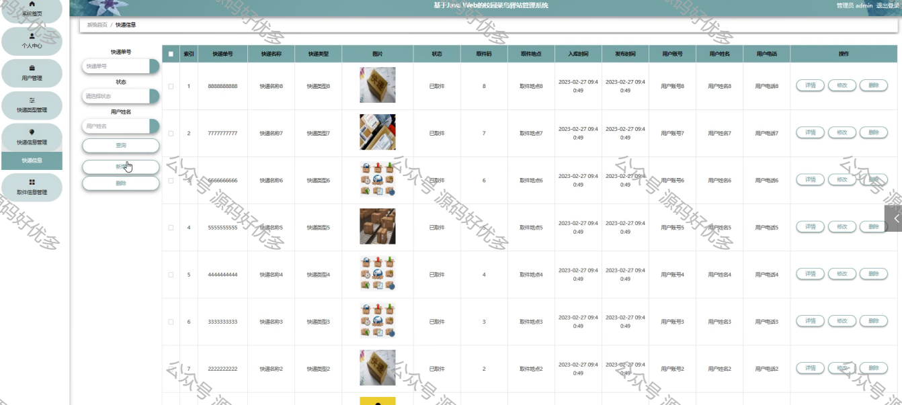
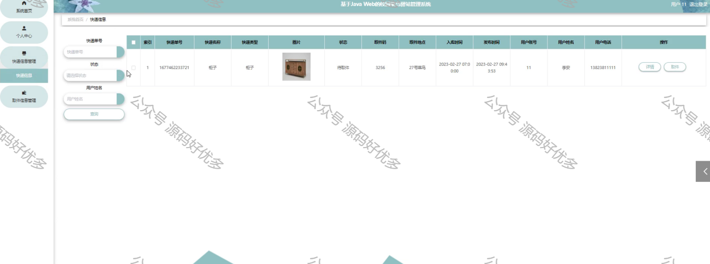
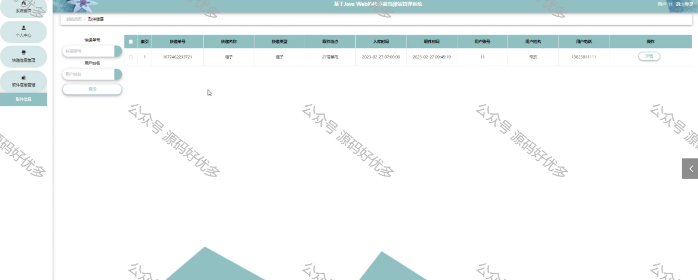

 
## 查看主页获取源码

> **作者介绍**： **✌**全网粉丝10W+本平台特邀作者、博客专家、CSDN新星计划导师、java领域优质创作者,博客之星、掘金/华为云/阿里云/InfoQ等平台优质作者、专注于毕业项目实战 **✌**

  

### 一、作品包含

源码+数据库+设计文档万字LW+PPT+全套环境和工具资源+部署教程

### 二、项目技术

前端技术：Html、Css、Js、Vue、Element-ui

数据库：MySQL

后端技术：Java、Spring Boot、MyBatis

  

### 三、运行环境

开发工具：IDEA/eclipse

数据库：MySQL8.0

数据库管理工具：Navicat10以上版本

环境配置软件： JDK1.8+Maven3.6.3

前端Nodejs：14

  

### 四、项目介绍
项目编号：springbootA057

随着世界经济信息化、全球化的到来和互联网的飞速发展，推动了各行业的改革。若想达到安全，快捷的目的，就需要拥有信息化的组织和管理模式，建立一套合理、动态的、交互友好的、高效的校园菜鸟驿站管理系统。当前的信息管理存在工作效率低，工作繁杂等问题，基于信息化的校园菜鸟驿站管理目前还没有完善的系统机制。
在此基础上，结合现有校园菜鸟驿站体系的特点，运用新技术，构建了以 springboot为基础的校园菜鸟驿站信息化管理体系。首先，以需求为依据，根据需求分析结果进行了系统的设计，并将其划分为管理员和用户二种角色和多个主要模块：用户、快递类型、快递信息、取件信息等。使用目前市场主流的技术springboot框架进行项目构建，基于B/S架构开发模式，使用Java开发语言和MySQL数据库对系统进行高内聚低耦合的设计，最终完成了校园菜鸟驿站管理系统的实现。
基于springboot框架的校园菜鸟驿站管理系统为当前传统管理模式提供了一个高效、便捷、信息化的解决方案，这为后期校园菜鸟驿站管理系统的优化提供了新的方向。

### 五、运行截图

  
